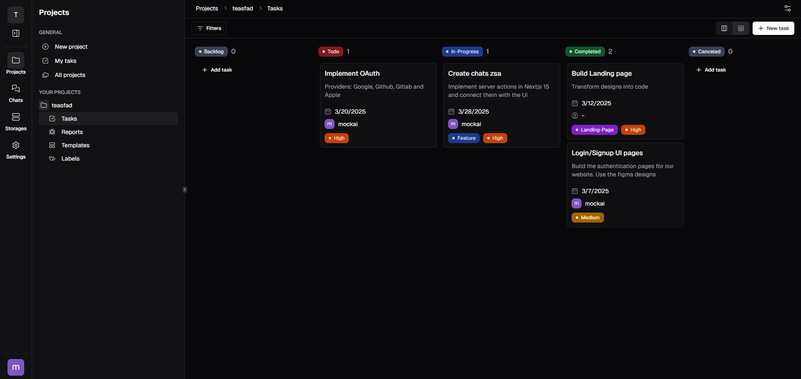

  
  
  
  
  

 
 

  

  <h1 align="center">Productify 2.0</h1>
  
Boost your team's productivity with real-time task and bug tracking, messaging, and file storage. Try it now!

  

     
    <a href="https://productify2.vercel.app/">View Demo</a> 
    &middot;
    <a href="https://productify2.vercel.app/">Report Bug</a>
    &middot;
    <a href="mailto:juanillaberia2002@gmail.com">Contact us</a>
  

## About The Project

Productify 2.0 is a **productivity app** designed for teams to manage tasks, track bugs, and collaborate more efficiently.  
With **real-time tracking**, messaging, and document storage, **Productify 2.0** is the all-in-one tool for teams to stay organized and communicate effectively.  

 

## 🌟 Why Productify 2.0?  

⚡ **Real-Time Tracking** – Track tasks, bugs, and progress in real-time  
💬 **Team Messaging** – Send private and group messages seamlessly  
📂 **File Storage** – Upload files and documentation for easy collaboration  
🚀 **Boost Team Efficiency** – Keep everyone on the same page with structured tracking  
🔒 **Private & Secure** – Ensure your data and communication are kept safe  

 

## 🚀 Get Started  

1️⃣ **Sign up** and create your team  
2️⃣ **Start managing tasks** with real-time updates  
3️⃣ **Track bugs** and collaborate with your team  
4️⃣ **Share and store files** securely  

> **💡 Stay productive, organized, and connected with Productify 2.0!**  

 

## 📌 Features  

✅ **Real-Time Task & Bug Tracking** – Stay on top of everything in your workflow  
✅ **Private & Group Messaging** – Keep communication seamless and private  
✅ **File Storage** – Easily upload and share documents within your team  
✅ **Customizable Workflows** – Adapt the app to fit your team's specific needs  
✅ **Developer-Friendly** – Integrate easily with your existing tools  

 

## 🛠 Built With  

  
  
  
  
  

